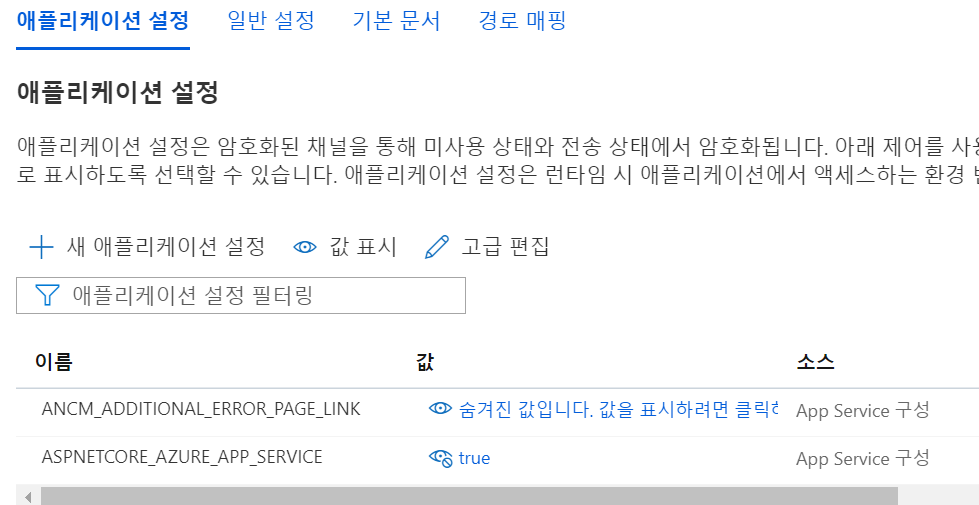
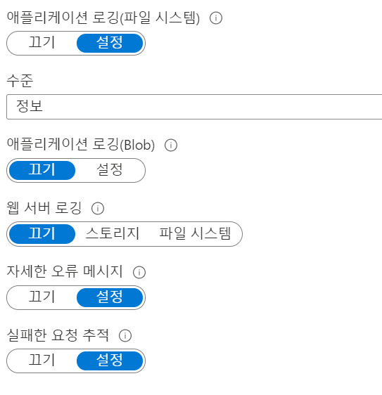
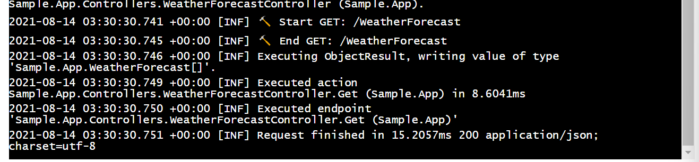

How to see logs in Azure Log Stream Web App using serilog

## Serilog

Using [serilog-aspnetcore](https://github.com/serilog/serilog-aspnetcore) package.

* [GitHub: serilog-aspnetcore](https://github.com/serilog/serilog-aspnetcore)
* [Nuget: Serilog.AspNetCore](https://www.nuget.org/packages/Serilog.AspNetCore)

## Write code

### Program.cs

Please read [Writing to the Azure Diagnostics Log Stream](https://github.com/serilog/serilog-aspnetcore#writing-to-the-azure-diagnostics-log-stream) section.

So, Wrtie log configuration code as below.

```csharp
public class Program
{
    public static void Main(string[] args)
    {
        var azureAppService = Convert.ToBoolean(Environment.GetEnvironmentVariable("ASPNETCORE_AZURE_APP_SERVICE"));

        var loggerConfiguration = new LoggerConfiguration()
            .MinimumLevel.Override("Microsoft", LogEventLevel.Information)
            .Enrich.FromLogContext()
            .WriteTo.Console()
            .WriteTo.Debug() // [optional] For Visual Studio Ouput Window
            ;

        if (azureAppService)
        {
            // IF ASPNETCORE_AZURE_APP_SERVICE is true, Write log file
            loggerConfiguration = loggerConfiguration.WriteTo.File(
                @"D:\home\LogFiles\Application\myapp.txt",
                fileSizeLimitBytes: 1_000_000,
                rollOnFileSizeLimit: true,
                shared: true,
                flushToDiskInterval: TimeSpan.FromSeconds(1));
        }

        // This logger does not appect service provider.
        Log.Logger = loggerConfiguration
            .CreateLogger();

        try
        {
            Log.Information("Starting host");

            CreateHostBuilder(args).Build().Run();
        }
        catch (Exception ex)
        {
            Log.Fatal(ex, "Host terminated unexpectedly");
        }
        finally
        {
            Log.CloseAndFlush();
        }
    }

    public static IHostBuilder CreateHostBuilder(string[] args) =>
        Host.CreateDefaultBuilder(args)
            .UseSerilog((context, services, configuration) =>
            {
                var azureAppService = Convert.ToBoolean(Environment.GetEnvironmentVariable("ASPNETCORE_AZURE_APP_SERVICE"));

                // You must configure logger again for service provider
                configuration
                    .ReadFrom.Configuration(context.Configuration)
                    .ReadFrom.Services(services)
                    .Enrich.FromLogContext()
                    .WriteTo.Console()
                    .WriteTo.Debug() // [optional] For Visual Studio Ouput Window
                    ;

                if (azureAppService)
                {
                    // IF ASPNETCORE_AZURE_APP_SERVICE is true, Write log file
                    configuration.WriteTo.File(
                        @"D:\home\LogFiles\Application\myapp.txt",
                        fileSizeLimitBytes: 1_000_000,
                        rollOnFileSizeLimit: true,
                        shared: true,
                        flushToDiskInterval: TimeSpan.FromSeconds(1));
                }
            })
            .ConfigureWebHostDefaults(webBuilder =>
            {
                webBuilder.UseStartup<Startup>();
            });
}
```

### Use logger

Log the Get action on  WeatherForecastController

```csharp
public IEnumerable<WeatherForecast> Get()
{
    _logger.LogInformation($"🔨 Start GET: /WeatherForecast ");
    try
    {
        var rng = new Random();
        return Enumerable.Range(1, 5).Select(index => new WeatherForecast
        {
            Date = DateTime.Now.AddDays(index),
            TemperatureC = rng.Next(-20, 55),
            Summary = Summaries[rng.Next(Summaries.Length)]
        })
        .ToArray();
    }
    finally
    {
        _logger.LogInformation($"🔨 End GET: /WeatherForecast ");
    }
}
```


## Azure Configruation

### Azure App Configuration

Add `ASPNETCORE_AZURE_APP_SERVICE`, set value `true`



### App Service Log



## Log Stream

👍 App log is shown on Log Stream

